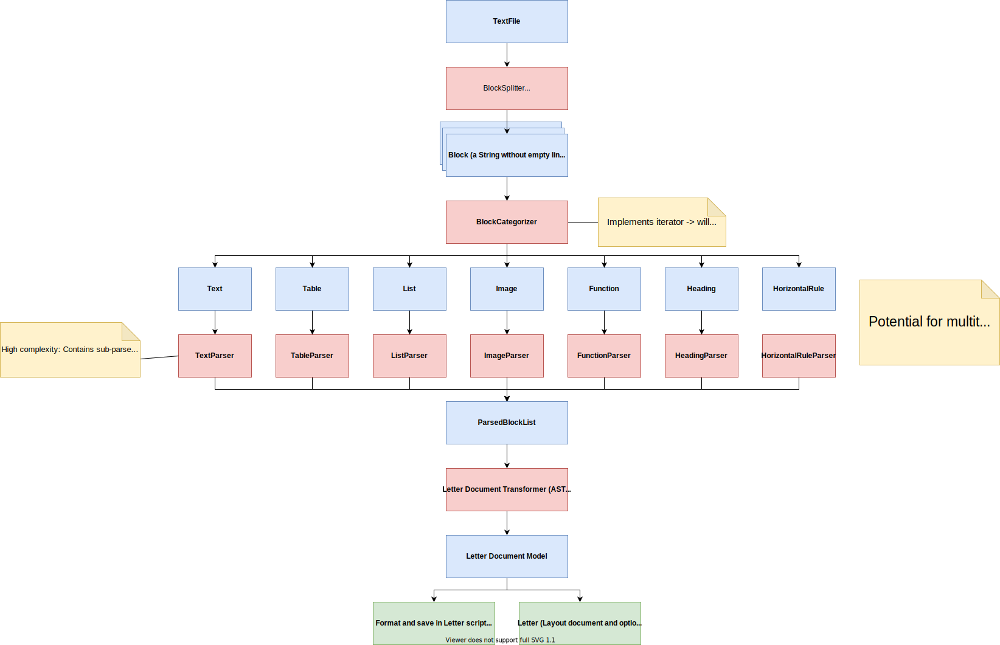

# md2letter

Markdown to [Letter](https://github.com/bennyboer/letter) script converter.
Write your documents in Markdown and let [Letter](https://github.com/bennyboer/letter) do the heavy lifting of laying
out the document and optionally creating a PDF.

## Example

```
cd cli
cargo run -- example.md
```

Output (in Letter script format - **not HTML!**):

```html
<heading>
    This is a title
</heading>
<paragraph>
    Here is a simple paragraph with
    <b>
        some
        <i>
            formatting
        </i>
    </b>
    .
</paragraph>
<section>
    <heading>
        This is a subtitle
    </heading>
    <list>
        <list-item>
            Item A
        </list-item>
        <list-item>
            Item B
        </list-item>
        <list ordered="true">
            <list-item>
                Hello
            </list-item>
            <list-item>
                World
            </list-item>
        </list>
        <list-item>
            Item C
        </list-item>
    </list>
    <code language="js">
        console.log('Hello World');
    </code>
</section>
```

## Support

Currently we support the following Markdown features:

- Headings
- Paragraphs
- Mixed bold and italic formatting
- Code blocks (with language modifier) and inline code
- Lists (ordered and unordered) - nesting supported
- Quote blocks
- Horizontal rules
- Links
- Images
- Tables
- Letter functions - as block or inline - (e. g. `#break` or `#image(width: 100px, height: 100px, src: image.png)`)

The output format is currently the Letter script format **only**.
For more details check the Letter repository [here](https://github.com/bennyboer/letter).

## Parser pipeline


